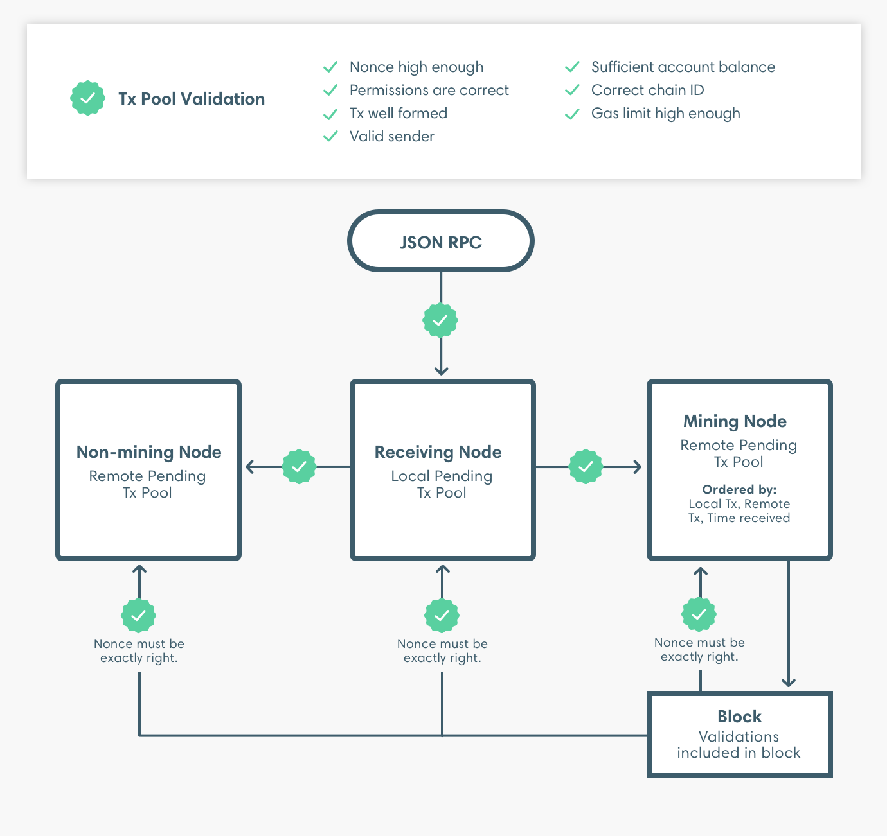

description: What transaction validation is performed when 
<!--- END of page meta data -->

# Validating Transactions 

When transactions are submitted and added to a block, validations are performed as illustrated. 

The set of transaction pool validations are repeated when the transaction is propagated. The same set of 
validations are repeated when the block including the transaction is imported except the nonce must be 
exactly right when importing the block. 

When the transaction is added to a block an additional validation is performed to check the total gas for the transaction
is less than the remaining gas limit for the block. After creating a block, the node imports the block and
the transaction pool validations are repeated. 